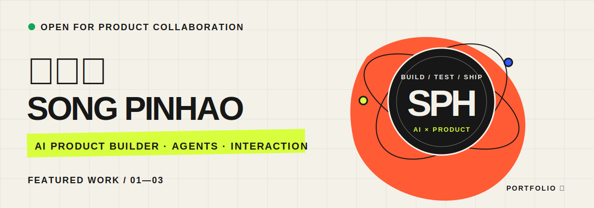
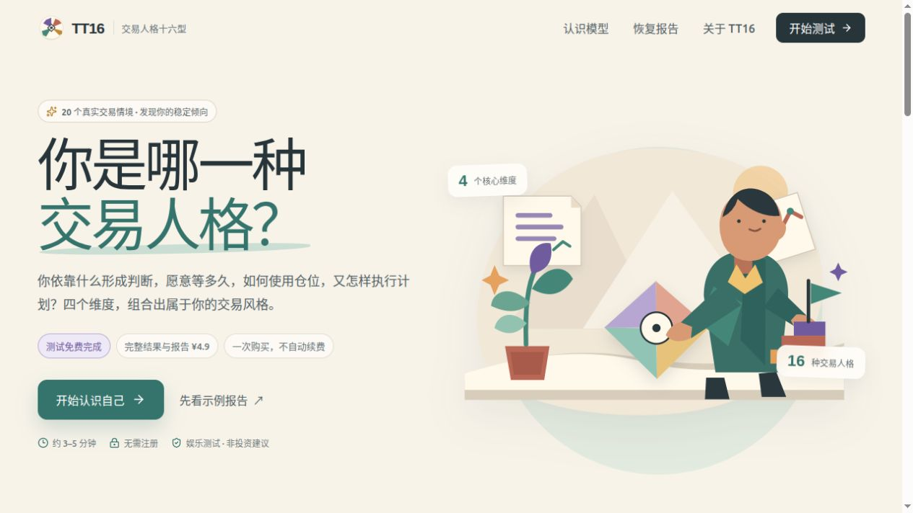
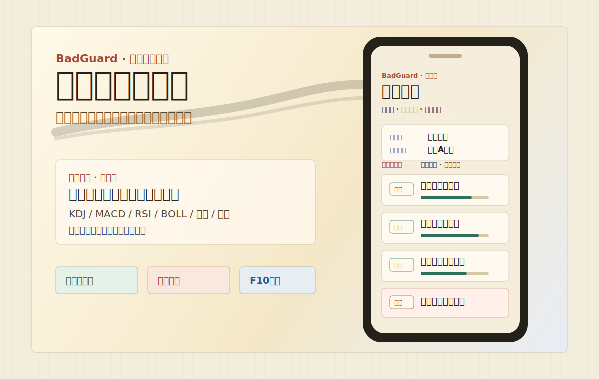
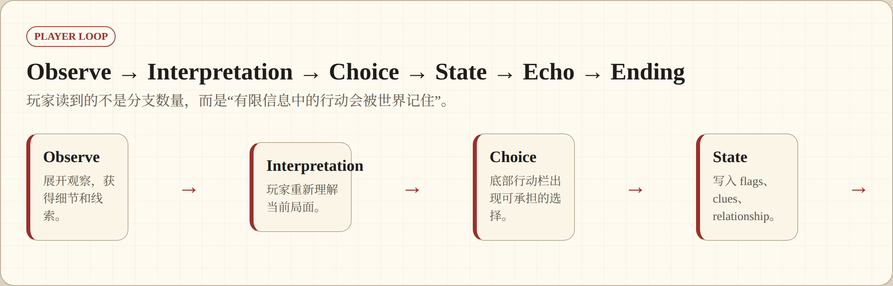
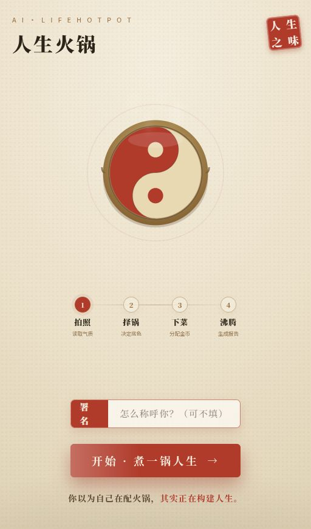

  

 

  
  
  

 

<table>
  <tr>
    <td width="62%" valign="top">
      <h2>你好，我是宋品豪 👋</h2>
      

        北京理工大学电子信息工程专业本科生，也是一名 <b>AI 原生产品开发者</b>。
        我把 Agent、叙事系统、生成式内容和交互设计装进真正能打开、能试玩、能分享的产品里。
      

      

        我偏爱从一个可以亲手玩的原型开始：先找到最小但完整的体验，再把数据、模型与工程系统逐层接上。
        目标不是做一张漂亮的概念图，而是让真实用户在一个链接里完成一次体验。
      

    </td>
    <td width="38%" valign="top">
      <h3>NOW / 2026</h3>
      <ul>
        <li>AI Agent 与 LLM 应用</li>
        <li>互动叙事与生成式体验</li>
        <li>像素世界与多模态内容</li>
        <li>从原型到上线的工程闭环</li>
      </ul>
    </td>
  </tr>
</table>

 

## Selected Work · 精选作品

六个近期项目，五个可以直接在线体验。点击图片进入 Demo，点击项目名查看源码与完整说明。

<table>
  <tr>
    <td width="50%" valign="top">
      
      <h3><a href="https://github.com/wzxsph/TT16">01 · TT16 交易人格十六型 ↗</a></h3>
      
用 20 个真实决策情境，把交易偏好整理成 16 种可复盘的人格地图。完整报告在浏览器本地生成。

      
<code>React 19</code> <code>TypeScript</code> <code>Vite</code> <code>Cloudflare</code>

      
    </td>
    <td width="50%" valign="top">
      
      <h3><a href="https://github.com/wzxsph/BadGuard">02 · BadGuard 散户看盘小纸条 ↗</a></h3>
      
每天收盘后，把 A 股常见技术状态整理成四张可解释的小纸条。只写观察与谨慎，不输出交易指令。

      
<code>Cloudflare Workers</code> <code>Python</code> <code>AkShare</code>

      
      
    </td>
  </tr>
  <tr>
    <td width="50%" valign="top">
      
      <h3><a href="https://github.com/wzxsph/hip-22-annotation-tool">03 · Hip 24-Point Annotation Tool ↗</a></h3>
      
面向髋关节 X 光片的本地标注与复核工具，支持 DICOM、YOLO 辅助初始化、24 个关键点和进度管理。

      
<code>FastAPI</code> <code>Canvas</code> <code>YOLO</code> <code>DICOM</code>

      
    </td>
    <td width="50%" valign="top">
      
      <h3><a href="https://github.com/wzxsph/Narrative-Trace">04 · Narrative Trace ↗</a></h3>
      
竖屏文字冒险与 AI 辅助创作管线。玩家观察、判断、行动，系统记住选择并生成结局画像。

      
<code>Interactive Fiction</code> <code>Agent Pipeline</code> <code>Cloudflare</code>

      
    </td>
  </tr>
  <tr>
    <td width="50%" valign="top">
      
      <h3><a href="https://github.com/wzxsph/Personality-Escape-Station">05 · Personality Escape Station ↗</a></h3>
      
完成 10 道人格测试，生成身份卡，再进入一个可探索、可互动、可串门的竖屏像素空间。

      
<code>React</code> <code>Pixel World</code> <code>AI Assets</code> <code>Workers</code>

      
    </td>
    <td width="50%" valign="top">
      
      <h3><a href="https://github.com/guanlili/ai-life-hotpot/tree/main">06 · AI 人生火锅 ↗</a></h3>
      
把人生选择隐喻成配火锅：拍照、选锅底、下食材、调蘸料，最后由 AI 生成专属人生报告。

      
<code>TanStack Start</code> <code>React 19</code> <code>Multimodal AI</code>

      
    </td>
  </tr>
</table>

 

## How I Build · 我如何做产品

<table>
  <tr>
    <td width="33%" valign="top">
      <h3>01 · Make it playable</h3>
      
先做出一个可以亲手完成的最小体验。用户的动作和反馈，比概念图更早验证产品。

    </td>
    <td width="33%" valign="top">
      <h3>02 · Make AI controllable</h3>
      
把生成、校验、审查、发布拆成清晰步骤，让 Agent 从偶尔惊喜变成稳定系统。

    </td>
    <td width="33%" valign="top">
      <h3>03 · Ship the boundary</h3>
      
部署路径、数据口径、免责声明和失败模式，和功能本身一样属于完整产品。

    </td>
  </tr>
</table>

## Recognition · 一些回响

- **青年共振奖** · 抖音 AI 创变者计划黑客松 — 构建人格测试驱动的 AI 像素世界
- **优秀奖** · MiraclePlus Vibeathon — 构建长篇网文创作 Claude Code Plugin

早期作品：**[StoryWeaver](https://github.com/wzxsph/StoryWeaver)** · 面向长篇网文创作的 Claude Code Plugin

## Toolbox · 常用工具

  
  
  
  
  
  
  
  

 

---

  <h2>有一个值得做出来的想法？</h2>
  
产品合作、开源项目，或只是聊聊 AI 原生体验，都欢迎来信。

  

    <a href="mailto:samsong.1a3@gmail.com"><b>samsong.1a3@gmail.com</b></a>
    &nbsp;·&nbsp;
    <a href="https://wzxsph.github.io/wzxsph/"><b>Portfolio</b></a>
    &nbsp;·&nbsp;
    <a href="https://github.com/wzxsph"><b>GitHub</b></a>
  

