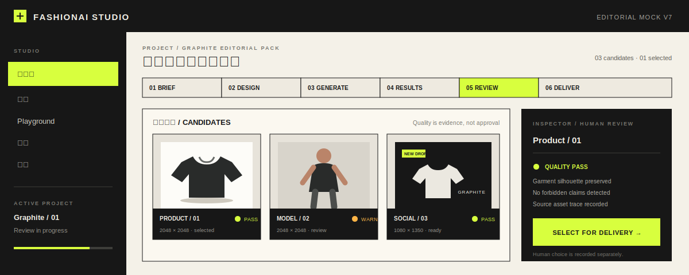
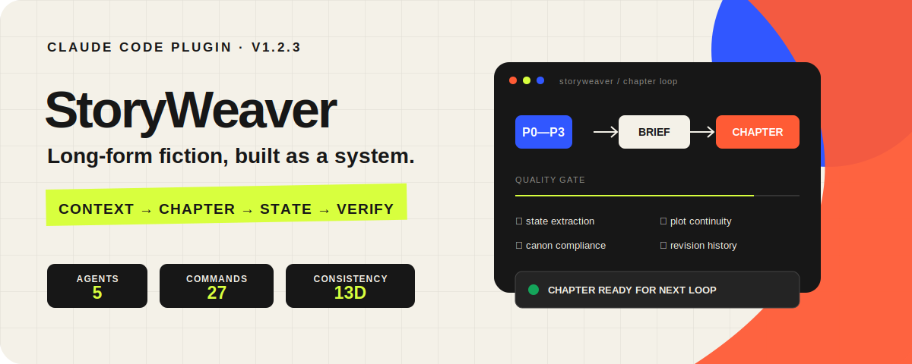

  <strong>English</strong> · <a href="./README_zh.md">简体中文</a>

  

 

  
  

## Hi, I am Pinhao Song 👋

I am an Electronic Information Engineering undergraduate at Beijing Institute of Technology and an **AI Product Builder**. I turn agent systems, generative media, and interaction ideas into products people can open, try, and share.

I like to begin with a small but complete experience, then connect the data, models, product boundaries, and deployment path needed to make it real.

**Shipped demos · Agent systems · Generative media · Full-stack delivery**

## Featured Work

### 01 · FashionAI Studio

- **Product:** an AI content workspace that turns a garment image and PNG logo into reviewable product shots, model images, and social assets.
- **Shipped proof:** an interactive browser-local Mock, a documented real <code>gpt-image-2</code> generation sample, task history, human review, downloadable outputs, and traceable delivery manifests.

<code>React</code> <code>TypeScript</code> <code>Node.js</code> <code>OpenAI-compatible</code> <code>Cloudflare</code>

**[Open Live Mock](https://fashionai-studio-demo.pages.dev/)** · **[Source](https://github.com/wzxsph/fashionai-studio)** · **[Product brief](https://github.com/wzxsph/fashionai-studio/blob/main/prd/prd_v1.md)**

### 02 · TT16 · TradeType 16

- **Product:** 20 realistic decision scenarios organized into 16 trading styles, with a complete browser-generated report covering strengths, blind spots, pressure responses, and review rules.
- **Shipped proof:** a free static experience with no signup or server-side answer storage, plus a separate Cloudflare Worker and D1 sandbox that demonstrates the commercial architecture without real payments.

<code>React 19</code> <code>TypeScript</code> <code>Vite</code> <code>Cloudflare Workers</code> <code>D1</code>

**[Try the free experience](https://wzxsph.github.io/TT16/)** · **[Commercial sandbox](https://tt16-commercial-sandbox.samsong-1a3.workers.dev)** · **[Source](https://github.com/wzxsph/TT16)**

### 03 · StoryWeaver

- **Product:** a Claude Code plugin for Chinese fiction projects beyond 300,000 characters, turning chapter writing into a repeatable loop of planning, context packaging, state extraction, verification, and revision.
- **Shipped proof:** version 1.2.3 with 5 collaborating agents, 27 namespaced commands, P0–P3 context, 13-dimensional consistency checks, strict validation, and an installable plugin structure.
- **Recognition:** Excellence Award at the MiraclePlus Vibeathon for a long-form web-fiction Claude Code plugin.

<code>Claude Code Plugin</code> <code>Agents</code> <code>JSON Schema</code> <code>RAG-style Context</code> <code>Validation</code>

**[Install StoryWeaver](https://github.com/wzxsph/StoryWeaver#安装)** · **[Source](https://github.com/wzxsph/StoryWeaver)**

## More Shipped Work

- **[CatOps](https://github.com/wzxsph/CatOps)** — a playable cat advertising-operations simulator balancing auction revenue, user experience, retention, and LTV. **[Live](https://catops-tycoon.samsong-1a3.workers.dev)**
- **[AutoInsight AI](https://github.com/wzxsph/AutoInsight_AI)** — an evidence-first autonomous-driving case review and task-handoff workspace. **[Live](https://autoinsight-ai.pages.dev)**
- **[Personality Escape Station](https://github.com/wzxsph/Personality-Escape-Station)** — a personality test, shareable identity card, and explorable vertical pixel room. **[Live](https://personality-escape-station.samsong-1a3.workers.dev)**
- **[Narrative Trace](https://github.com/wzxsph/Narrative-Trace)** — a vertical interactive-fiction experience with an AI-assisted creation pipeline. **[Play](https://wzxsph.github.io/Narrative-Trace/)**
- **[BadGuard](https://github.com/wzxsph/BadGuard)** — four explainable daily notes for observing common A-share technical states without issuing trading instructions. **[Live](https://wzxsph.github.io/BadGuard/)**
- **[Hip 24-Point Annotation Tool](https://github.com/wzxsph/hip-22-annotation-tool)** — a local DICOM annotation and review workspace with YOLO-assisted initialization.
- **[AI Life Hotpot](https://github.com/guanlili/ai-life-hotpot/tree/main)** — a team-built multimodal experience that turns life choices into a personalized hotpot report. **[Live](https://ai-life-hotpot.guanhongli1921.workers.dev)**

## Recognition

- **Youth Resonance Award** · Douyin AI Creator Program Hackathon — built a personality-test-driven AI pixel world.
- **Excellence Award** · MiraclePlus Vibeathon — built a Claude Code plugin for long-form web fiction.

## How I Build

1. **Make it playable.** Start with the smallest complete experience a user can finish by hand.
2. **Make AI controllable.** Separate generation, validation, review, and publishing into explicit steps.
3. **Ship the boundary.** Treat deployment, data definitions, disclaimers, and failure modes as part of the product.

## Now

- Building agent systems and LLM products with clear human checkpoints.
- Exploring generative media, interactive narratives, and playful product interfaces.
- Turning prototypes into deployed systems with explicit data and operational boundaries.

## Toolbox

**Claude Code · Codex · Python · TypeScript · React · FastAPI · Node.js · Cloudflare · GitHub Actions**

---

  <h2>Have a product worth shipping?</h2>
  
I am open to product collaborations, open-source work, and conversations about AI-native experiences.

  

    <a href="mailto:nizabentley397@gmail.com"><strong>nizabentley397@gmail.com</strong></a>
    &nbsp;·&nbsp;
    <a href="https://wzxsph.github.io/wzxsph/"><strong>Portfolio</strong></a>
    &nbsp;·&nbsp;
    <a href="https://github.com/wzxsph"><strong>GitHub</strong></a>
  

